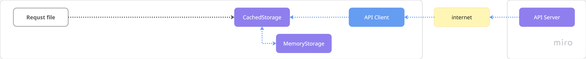
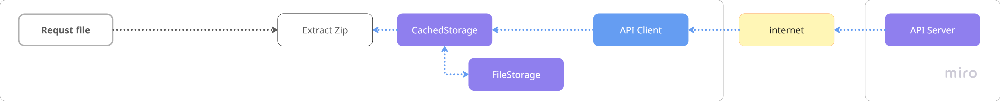
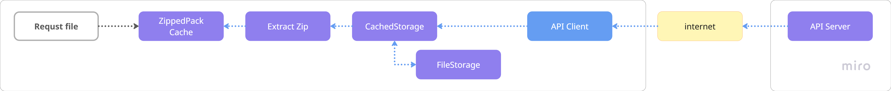

## キャッシュ構成例

いくつかのキャッシュフロー構成の例を紹介します。
どういった用途か・何を高速化したいかで適切な構成は変わってくるので、参考にしつつ求める構成を組んでください。

### ファイルストレージ

- FileStorageは通常のファイルシステムをラップしたものです。
- StorageSharpで扱うインタフェースに合わせて通常のファイルシステムをラップしています。


```c#
var storage = new FileStorage("Storage");
await cachedStorage.WriteAsync("example.bin", new byte[] {0,1,2});
var fileData = await cachedStorage.ReadAsync("example.bin");
```


### メモリストレージ

- MemoryStorageはメモリにキーバリューとしてファイル名・ファイルバイナリを保持するものです。
- FileStorage等と同じインタフェースで利用でき、しかし記憶先がファイルではなくメモリになります。
- ファイルストレージと違い物理ファイルを作成しないため、ユーザーにとっては見えない情報になります。
  - ファイルとして直接見られたくない場合はメモリストレージの利用を検討してください。
- メモリのみに存在するためアプリを終了すると消失します。（＝非永続データ）
- メモリにデータとして保持されるためメモリ使用量には注意してください。

### 

```c#
var storage = new MemoryStorage();
await cachedStorage.WriteAsync("example.bin", new byte[] {0,1,2});
var fileData = await cachedStorage.ReadAsync("example.bin");
```


### キャッシュなしでサーバーからファイルダウンロード

- StorageSharpを使わない構成のイメージです。
- ここにStorageSharpを導入していく際の構成例が以降の例となります。


### ファイルキャッシュ

- 二回目以降のダウンロードの高速化を狙った構成です。
- 構成
  - ダウンロードしたファイルをファイルキャッシュに保存します。
- 特性
  - 再度リクエストがきた際はキャッシュが使われるのでダウンロード時間の分を高速化できます。
    - クラウド側に負荷がかからないのでコスト削減のメリットがあります。
  - ファイルとして保存されるためユーザーが直接見ることができます。


```csharp
var cachedStorage = new CachedStorage(
    new FileStorage("Cache/Download/"),
    new SampleAPIStorage());
var fileData = await cachedStorage.ReadAsync("example.bin");
// 2回目以降のReadAsyncはキャッシュから高速に取得される
```

### メモリキャッシュ

- 二回目以降のダウンロードの高速化を狙った構成です。
- 構成
  - ダウンロードしたファイルをメモリキャッシュに保存します。
- 特性
  - 再度リクエストがきた際はキャッシュが使われるのでダウンロード時間の分を高速化できます。
    - クラウド側に負荷がかからないのでコスト削減のメリットがあります。
  - ファイルキャッシュと違い、ユーザーが直接見ることができないです。
  - オンメモリに情報を保持するためメモリ容量を消費します。利用の際はメモリ使用量への注意が必要です。



```csharp
var cachedStorage = new CachedStorage(
    new MemoryStorage(),
    new SampleAPIStorage());
var fileData = await cachedStorage.ReadAsync("example.bin");
// 2回目以降のReadAsyncはキャッシュから高速に取得される
```

### ファイルキャッシュ＋ZIP展開

- ダウンロードする対象がZipファイルの場合の例。
- 構成
  - ダウンロードしたZipファイルはファイルとしてキャッシュに保存します。
- 特性
  - 再度リクエストがきた際はキャッシュが使われるのでダウンロード時間の分を高速化できます。
    - クラウド側に負荷がかからないのでコスト削減のメリットがあります。
  - 利用の都度Zip展開します。
    - 毎回展開するのでファイル次第で重いです。



```csharp
var pack = new CachedStorage(
    new SampleAPIStorage(),
    new FileStorage("Cache/Download/"));
var zipFilePath = pack.Load();
var zipFilePath = await pack.ReadAsync("archive.zip");
// zipFilePathにある.zipを手動でdecompressする
```

### ファイルキャッシュ＋Zip展開＋展開結果をファイルキャッシュ

- 都度Zip展開される時間がかかるのをキャッシュすることで高速化します。
- 構成
  - ZippedPacksを入れることでZipファイルの展開とキャッシュをまるごと委ねます。
- 特性
  - 2度目以降のリクエストではキャッシュが効くので、ダウンロード＋Zip展開の時間をまるごと短縮できます。
  - Zipファイル、Zip展開後ファイルの一式がローカルストレージに置かれます。
    - ストレージ容量に注意が必要です。
    - ユーザーは展開後ファイルをさわることができるため、さわられたくない場合は注意が必要です。



```csharp
var packages = new ZippedPacks(
    new ZippedPacks.Settings("Tmp/Extracted"),
    new CachedStorage(
        new FileStorage("Cache/Download/"),
        new SampleAPIStorage()));
var decompressedZipPath = await packages.Load(archiveScheme);
```

### メモリキャッシュ＋Zip展開＋展開結果をファイルキャッシュ

- ユーザーにできるだけファイルを見られたくない場合の構成です。
- 構成
  - CacheStorageをMemoryStorageに替えることで物理ファイルとしての保存を止めます。
- 特性
  - Zip展開ファイルが一時的に作成されますが、都度Load(),Unload()を行うことで物理ファイルとして存在する期間をなるだけ短くします。
  - 厳密にはLoad()～Unload()までの期間はファイルが存在するので、完全にファイルを作らないわけではありません。
  - Zipをメモリにキャッシュするのでアプリを起動しなおすと再度ダウンロードが行われます。
  - オンメモリにダウンロードデータが配置されるため、メモリ使用量には注意が必要です。


```csharp
var packages = new ZippedPacks(
    new ZippedPacks.Settings("Tmp/Extracted"),
    new CachedStorage(
        new MemoryStorage(),
        new SampleAPIStorage()));
var decompressedZipPath = await packages.Load(archiveScheme);
// 展開したファイルを読込・使用
await packages.Unload(archiveScheme);
```

